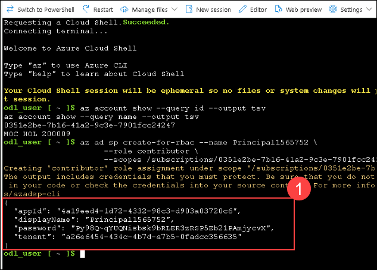

# Lab 01: Integrating Azure Key Vault with Azure DevOps

## Lab overview

Azure Key Vault provides secure storage and management of sensitive data, such as keys, passwords, and certificates. Azure Key Vault includes supports for hardware security modules, as well as a range of encryption algorithms and key lengths. By using Azure Key Vault, you can minimize the possibility of disclosing sensitive data through source code, which is a common mistake made by developers. Access to Azure Key Vault requires proper authentication and authorization, supportxing fine grained permissions to its content.

In this lab, you will see how you can integrate Azure Key Vault with an Azure DevOps pipeline by using the following steps:

- Create an Azure Key vault to store a MySQL server password as a secret.
- Create an Azure service principal to provide access to secrets in the Azure Key vault.
- Configure permissions to allow the service principal to read the secret.
- Configure pipeline to retrieve the password from the Azure Key vault and pass it on to subsequent tasks.

## Objectives

After you complete this lab, you will be able to:

- Exercise 0: Configure the lab prerequisites.
- Exercise 1: Setup CI pipeline to build eShopOnWeb container.

## Estimated timing: 45 minutes

## Architecture Diagram

   

# Exercise 0: Configure the lab prerequisites

In this exercise, you will set up the prerequisites for the lab, which consist of a new Azure DevOps project with a repository based on the [eShopOnWeb](https://github.com/MicrosoftLearning/eShopOnWeb).

## Task 1: Set up an Azure DevOps organization

1. On your lab VM open **Edge Browser** on desktop and navigate to https://go.microsoft.com/fwlink/?LinkId=307137 and login with ODL credentials.

1. In the Action Required tab, choose **Ask Later**.

1. On the next page accept defaults and click on **Continue**.

    

1. On the **Almost Done...** page fill the captcha and click on **Continue**. 

    

1. On the Azure Devops page click on **Azure DevOps(1)** located at top left corner and then click on **Organization Settings (2)** at the left down corner.

    
    
1. In the **Organization Settings** window on the left menu click on **Billing (1)** and select **Setup Billing (2)**, It will automatically select your **azure subscription (3)** then click on **Save(4)**.

        

1. On the **MS Hosted CI/CD** section under **Paid parallel jobs** enter value **1** and at the end of the page click on **Save**.

    

## Task 2: Create and configure the team project

In this task, you will create an **eShopOnWeb** Azure DevOps project to be used by several labs.

1.  On your lab computer, in a browser window open your Azure DevOps organization. Click on **New Project**. Give your project the name **eShopOnWeb** and choose **Scrum** on the **Work item process** dropdown. Click on **+ Create project**.

    

## Task 3: Import eShopOnWeb Git Repository

In this task you will import the eShopOnWeb Git repository that will be used by several labs.

1.  On your lab computer, in a browser window open your Azure DevOps organization and the previously created **eShopOnWeb** project. Click on **Repos>Files** , **Import**. On the **Import a Repository** window, paste the following URL https://github.com/MicrosoftLearning/eShopOnWeb.git  and click on **Import**:

    

1. The repository is organized the following way:
    - **.ado** folder contains Azure DevOps YAML pipelines.
    - **.devcontainer** folder container setup to develop using containers (either locally in VS Code or GitHub Codespaces).
    - **infra** folder contains Bicep & ARM infrastructure as code templates used in some lab scenarios.
    - **.github** folder container YAML GitHub workflow definitions.
    - **src** folder contains the .NET 8 website used on the lab scenarios.

## Task 4: Set main branch as default branch

1. Go to **Repos>Branches**.
1. Hover on the **main** branch then click the ellipsis on the right of the column.
1. Click on **Set as default branch**.

    

# Exercise 1: Setup CI pipeline to build eShopOnWeb container

Setup CI YAML pipeline for:
- Creating an Azure Container Registry to keep the container images
- Using Docker Compose to build and push **eshoppublicapi** and **eshopwebmvc** container images. Only **eshopwebmvc** container will be deployed.

## Task 1:  Create a Service Principal

In this task, you will create a Service Principal by using the Azure CLI, which will allow Azure DevOps to:
- Deploy resources on your Azure subscription
- Have read access on the later created Key Vault secrets.

> **Note**: If you do already have a Service Principal, you can proceed directly to the next task.

You will need a Service Principal to deploy  Azure resources from Azure Pipelines. Since we are going to retrieve secrets in a pipeline, we will need to grant permission to the service when we create the Azure Key Vault.

A Service Principal is automatically created by Azure Pipelines, when you connect to an Azure subscription from inside a pipeline definition or when you create a new Service Connection from the project settings page (automatic option). You can also manually create the Service Principal from the portal or using Azure CLI and re-use it across projects.

1.  From the lab computer, start a web browser, navigate to the [**Azure Portal**](https://portal.azure.com), and sign in with the user account that has the Owner role in the Azure subscription you will be using in this lab and has the role of the Global Administrator in the Azure AD tenant associated with this subscription.
1.  In the Azure portal, click on the **Cloud Shell** icon, located directly to the right of the search textbox at the top of the page.
1.  If prompted to select either **Bash** or **PowerShell**, select **Bash**.

    >**Note**: If this is the first time you are starting **Cloud Shell**. In the Getting started tab select **No storage account required** checkbox and select the subscription you are using in this lab, and select **Apply**.

1.  From the **Bash** prompt, in the **Cloud Shell** pane, run the following commands to retrieve the values of the Azure subscription ID and subscription name attributes:

    ```
    az account show --query id --output tsv
    az account show --query name --output tsv
    ```

    > **Note**: Copy both values to a text file. You will need them later in this lab.

1.  From the **Bash** prompt, in the **Cloud Shell** pane, run the following command to create a Service Principal (replace the **myServicePrincipalName** with any unique string of characters consisting of letters and digits) and **mySubscriptionID** with your Azure subscriptionId :

    ```
    az ad sp create-for-rbac --name myServicePrincipalName \
                         --role contributor \
                         --scopes /subscriptions/mySubscriptionID
    ```

    > **Note**: The command will generate a JSON output. Copy the output to text file. You will need it later in this lab.

    

1. Next, from the lab computer, start a web browser, navigate to the Azure DevOps **eShopOnWeb** project. Click on **Project Settings > Service connections (under Pipelines)** and **Create service connection**.

    

1. On the **New service connection** blade, select **Azure Resource Manager** and **Next** (may need to scroll down).

1. The choose **Service Principal (manual)** and click on **Next**.

1. Fill in the empty fields using the information gathered during previous steps:
    - Subscription Id and Name
    - Service Principal Id (or clientId), Key (or Password) and TenantId.
    - In **Service connection name** type **azure subs**. This name will be referenced in YAML pipelines when needing an Azure DevOps Service Connection to communicate with your Azure subscription.

      

1. Click on **Verify and Save**.

## Task 2: Setup and Run CI pipeline

In this task, you will import an existing CI YAML pipeline definition, modify and run it. It will create a new Azure Container Registry (ACR) and build/publish the eShopOnWeb container images.

1. From the lab computer, start a web browser, navigate to the Azure DevOps **eShopOnWeb** project. Go to **Pipelines > Pipelines** and click on **Create Pipeline**.

1.  On the **Where is your code?** window, select **Azure Repos Git (YAML)** and select the **eShopOnWeb** repository.

1.  On the **Configure your pipeline** section, choose **Existing Azure Pipelines YAML file**. Provide the following path **/.ado/eshoponweb-ci-dockercompose.yml** and click on **Continue**.

    

1. In the YAML pipeline definition, customize your Resource Group name by replacing **NAME** in **AZ400-EWebShop-<inject key="DeploymentID" enableCopy="false"/>** and replace **YOUR-SUBSCRIPTION-ID** with the your own Azure subscriptionId.

1. Click on **Save and Run** twice. and wait for the pipeline to execute successfully.

1. You will get the notification to give access to create ACR fro images, select **View**. In Waiting for review tab, select **Permit** and then select **Permit** in Permit access tab.

    > **Note**: The build may take a few minutes to complete. The build definition consists of the following tasks:
    - **AzureResourceManagerTemplateDeployment** uses **bicep** to deploy an Azure Container Registry.
    - **PowerShell** task take the bicep output (acr login server) and creates pipeline variable.
    - **DockerCompose** task builds and pushes the container images for eShopOnWeb to the Azure Container Registry .

1. Your pipeline will take a name based on the project name. Lets **rename** it for identifying the pipeline better. Go to **Pipelines > Pipelines** and click on the recently created pipeline. Click on the ellipsis and **Rename/move** option. Name it **eshoponweb-ci-dockercompose** and click on **Save**.

1. Once the execution is finished, on the Azure Portal, open previously defined Resource Group, and you should find an Azure Container Registry (ACR) with the created container images **eshoppublicapi** and **eshopwebmvc**. You will only use **eshopwebmvc** on the deploy phase.

    

1. Click on **Access Keys**. Select **Show** and copy the **password** value, it will be used in the following task, as we will keep it as a secret  in Azure Key Vault.
    > **Note**: If you do not see password field, please select the **Admin user** chceckbox to Enabled.

    

## Task 3: Create an Azure Key vault

In this task, you will create an Azure Key vault by using the Azure portal.

For this lab scenario, we will have a Azure Container Instance (ACI) that pull and runs a container image stored in Azure Container Registry (ACR). We intend to store the password for the ACR as a secret in the key vault.

1. In the Azure portal, in the **Search resources, services, and docs** text box, type **Key vaults** and press the **Enter** key twice.

1. Click on **+ Create** in Key vaults tab.

1. On the **Basics** tab of the **Create key vault** blade, specify the following settings and click on **Next**:

    | Setting | Value |
    | --- | --- |
    | Subscription |*Leave it as default subscription*|
    | Resource group | **AZ400-EWebShop-<inject key="DeploymentID" enableCopy="false" />** |
    | Key vault name | **keyvault<inject key="DeploymentID" enableCopy="false" />**|
    | Region | an Azure region close to the location of your lab environment |
    | Pricing tier | **Standard** |
    | Days to retain deleted vaults | **7** |
    | Purge protection | **Disable purge protection** |

1.  On the **Access configuration** tab of the **Create key vault** blade,under **Permission model** select **Vault access policy** and click on **Review + Create** and **Create**.

1. On the **Your deployment is complete** blade, click on **Go to resource**.

    > **Note**: You need to secure access to your key vaults by allowing only authorized applications and users. To access the data from the vault, you will need to provide read (Get/List) permissions to the previously created service principal that you will be using for authentication in the pipeline.

1. Navigate to the newly created key vault,in the left navigation pane,click on **Access policies** and click on **+ Create**

     - On the **Permission** blade, check **Get** and **List** permissions below **Secret permissions**. Click on **Next**.
     - On the **Principal** blade, search for the **previously created Service Principal**, either using the Id or Name given, select it. Click on **Next** twice.
     - On the **Review + create** blade, click on **Create**

      
      > **Note**: Wait for the Azure Key vault to be provisioned. This should take less than 1 minute.

1. On the Azure Key vault blade, in the vertical menu on the left side of the blade, in the **Objects** section, click on **Secrets**.

1. On the **Secrets** blade, click on **+ Generate/Import**.

1. On the **Create a secret** blade, specify the following settings and click on **Create** (leave others with their default values):

    | Setting | Value |
    | --- | --- |
    | Upload options | **Manual** |
    | Name | **acr-secret** |
    | Value | ACR access password copied in previous task |

## Task 4: Create a Variable Group connected to Azure Key Vault

In this task, you will create a Variable Group in Azure DevOps that will retrieve the ACR password secret from Key Vault using the Service Connection (Service Principal)

1. On your lab computer, start a web browser and navigate to the Azure DevOps project **eShopOnWeb**.

1.  In the vertical navigational pane of the of the Azure DevOps portal, select **Pipelines>Library**. Click on **+ Variable Group**.

1. On the **New variable group** blade, specify the following settings:

    | Setting | Value |
    | --- | --- |
    | Variable Group Name | **eshopweb-vg** |
    | Link secrets from Azure key vault as variables | **enable** |
    | Azure subscription | **Available Azure service connection > Azure subs** |
    | Key vault name | Select key vault created **keyvault<inject key="DeploymentID" enableCopy="false" />**|

    > **Note**: If you don't find the key vault that you had created in the previous task,in the Azure subscription drop-down list, select the Azure subscription into which you deployed the Azure resources earlier in the lab, click on **Authorize**, and from the dropdown select  **Available Azure service connection > Azure subs** and select the key vault that you had created earlier.

1. Under **Variables**, click on **+ Add** and select the **acr-secret** secret. Click on **OK**.
1. Click on **Save**.

    

## Task 5: Setup CD Pipeline to deploy container in Azure Container Instance(ACI)

In this task, you will import a CD pipeline, customize it and run it for deploying the container image created before in a Azure Container Instance.

1. From the lab computer, start a web browser, navigate to the Azure DevOps **eShopOnWeb** project. Go to **Pipelines > Pipelines** and click on **New pipeline**.

1.  On the **Where is your code?** window, select **Azure Repos Git (YAML)** and select the **eShopOnWeb** repository.

1.  On the **Configure** section, choose **Existing Azure Pipelines YAML file**. Provide the following path **/.ado/eshoponweb-cd-aci.yml** and click on **Continue**.

1. In the YAML pipeline definition, customize:

    - **YOUR-SUBSCRIPTION-ID** with your Azure subscription id.
    - **az400eshop-NAME** replace NAME with <inject key="DeploymentID" enableCopy="false"/>.
    - Replace **YOUR-ACR.azurecr.io** and **ACR-USERNAME** with your ACR login server and Username. (To retrieve the login server and username  navigate to azure portal,search for Container Registries and click on the available container registry,from the left navigation pane go to **Access Keys** and copy the login server and the username).
    - **AZ400-EWebShop-NAME** with the resource group name defined before in the lab.(replace NAME with <inject key="DeploymentID" enableCopy="false"/>)

1. Click on **Save and run**.
1. Once the Deploy Stage wants to start, you are prompted with **Permissions Needed**, as well as an orange bar saying **This pipeline needs permission to access 2 resources before this run can continue to Docker Compose to ACI**.
    
1. Click on **View**
1. From the **Waiting for Review** pane, click **Permit**.
1. Validate the message in the **Permit popup** window, and confirm by clicking **Permit**.
1. Wait for this to complete successfully.

    > **Note**: The deployment may take a few minutes to complete. The CD definition consists of the following tasks:
    - **Resources** : it is prepared to automatically trigger based on CI pipeline completion. It also download the repository for the bicep file.
    - **Variables (for Deploy stage)** connects to the variable group to consume the Azure Key Vault secret **acr-secret**
    - **AzureResourceManagerTemplateDeployment** deploys the Azure Container Instance (ACI) using bicep template and provides the ACR login parameters to allow ACI to download the previously created container image from Azure Container Registry (ACR).

1. Your pipeline will take a name based on the project name. Lets **rename** it for identifying the pipeline better. Go to **Pipelines>Pipelines** and click on the recently created pipeline. Click on the ellipsis and **Rename/move** option. Name it **eshoponweb-cd-aci** and click on **Save**.

   > **Congratulations** on completing the task! Now, it's time to validate it. Here are the steps:
   - If you receive a success message, you can proceed to the next task.
   - If not, carefully read the error message and retry the step, following the instructions in the lab guide.
   - If you need any assistance, please contact us at cloudlabs-support@spektrasystems.com. We are available 24/7 to help you out.
 
   <validation step="10127a4a-453b-48da-b290-fea76e5a1dfe" />

## Review

In this lab, you integrated Azure Key Vault with an Azure DevOps pipeline by using the following steps:

- Created an Azure Key vault to store a MySQL server password as a secret.
- Created an Azure service principal to provide access to secrets in the Azure Key vault.
- Configured permissions to allow the service principal to read the secret.
- Configured pipeline to retrieve the password from the Azure Key vault and pass it on to subsequent tasks.